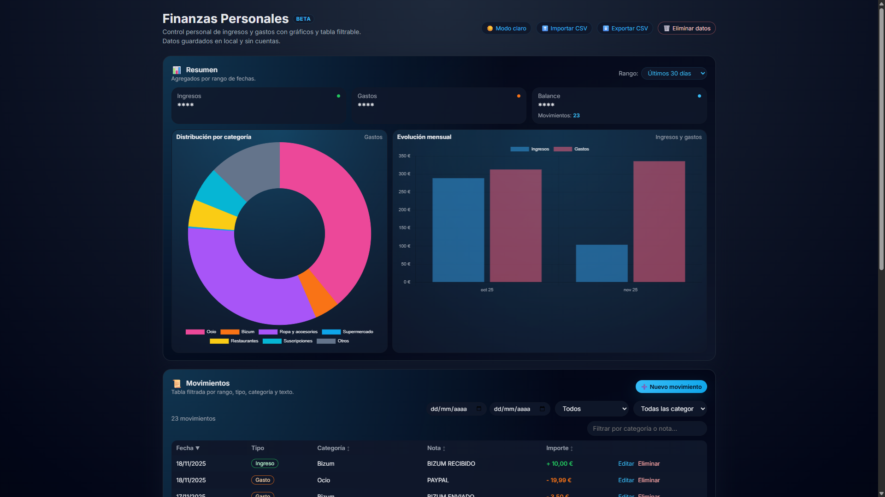
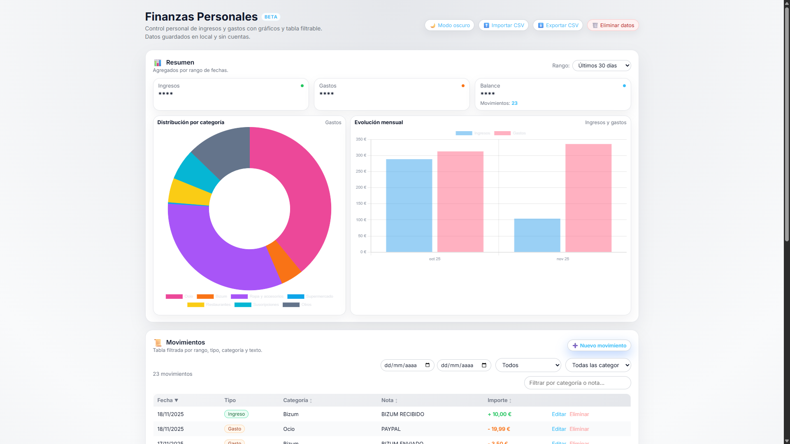

# 📊 Finanzas Personales — Gestor local sin cuentas

Finanzas Personales es una aplicación web ligera y moderna para gestionar tus ingresos y gastos de forma totalmente privada.
No utiliza servidores, no requiere cuentas y no sube tus datos a ninguna parte.
Toda la información se almacena exclusivamente en tu navegador mediante localStorage.

Ideal para quienes buscan una solución rápida, simple y 100% privada.

------------------------------------------------------------

## ✨ Características principales

### 🔒 Privacidad total
- 📁 Datos 100% locales (sin servidores ni nube).
- 🔐 Nada sale de tu dispositivo.
- 🚫 No requiere login ni registro.

### 💰 Gestión de movimientos
- 📝 Registro de ingresos y gastos.
- 📅 Fecha, categoría, importe y nota opcional.
- ➕ Modal para añadir/editar movimientos.

### 🧠 Categorías inteligentes
- 💡 Detección **automática** de categorías al importar CSV.
- 🎯 **Clasificación automática**: supermercado, transporte, restauración, ocio, suscripciones, Bizum, ropa, salud, nómina y más.
- 🏷️ Gestión **personalizada** de categorías.

### 🔎 Filtros avanzados
- Tipo (ingreso / gasto)
- Categoría
- Rango de fechas
- Búsqueda por texto
- Ordenación por columnas

### 📊 Visualización con gráficos
- 🍩 Distribución de gastos por categoría
- 📉 Evolución mensual de ingresos y gastos
- Gráficos interactivos con Chart.js

### 📥 Importación / 📤 Exportación
- Importar desde:
  - ✔️ CSV con formato especifico (mencionado mas abajo)
- Exportación a CSV compatible con Excel / Google Sheets

### 🌓 Interfaz moderna
- 🌙 Modo oscuro
- ☀️ Modo claro
- 💾 Persistencia automática de preferencias
- 📱 Diseño responsive, perfecto en móvil

### 🗑️ Control completo
- Borrar todos los datos con confirmación
- Sin riesgos, todo es local

------------------------------------------------------------

## 🚀 Tecnologías utilizadas

| Tecnología | Uso |
|-----------|-----|
| HTML5                | Estructura de la interfaz |
| CSS3                 | Diseño, temas, responsive |
| JavaScript Vanilla   | Lógica principal sin frameworks |
| Chart.js             | Gráficos de datos |
| localStorage         | Persistencia local |
| Google Fonts (Inter) | Tipografía |

------------------------------------------------------------

## 📦 Instalación y uso

No requiere instalación ni dependencias.

### 1️⃣ Clonar el repositorio
``git clone https://github.com/guimmy-sites/finanzas-personales.git``

### 2️⃣ Abrir el proyecto
Simplemente situate en la ruta del archivo ``index.html``

### 📱 Para usarlo desde el móvil
Usa un servidor local como **Live Server (VS Code)** o:

``python -m http.server 5500``

Luego accede desde qualquier dispositivo **en la misma red** a:
``http://IP_DE_TU_PC:5500``

------------------------------------------------------------

## 📁 Importar datos desde CSV

### ✔️ Formato propio del proyecto
Columnas:
``id, type, amount, category, date, note``

### 🧠 Sistema inteligente de categorización
Detecta palabras clave y clasifica movimientos, por ejemplo:
- Supermercado
- Restauración
- Fast food / Sushi / Kebab
- Ropa
- Transporte
- Suscripciones
- Bizum
- Nómina
- Salud
- Ocio
…y más.

------------------------------------------------------------

## 🛡 Seguridad y privacidad

- 🔒 No se envía ningún dato a servidores
- 🧠 No se usan cookies de seguimiento
- 📍 No requiere autenticación
- 💻 Todo queda guardado en tu navegador
- 🧹 Puedes borrar tus datos cuando quieras


------------------------------------------------------------

## 🖥 Vista previa del diseño

- 🎨 Interfaz moderna y limpia
- 🌑 Tema oscuro por defecto
- 🌕 Tema claro opcional
- 📱 Perfecto en móvil

#### **Modo oscuro**


#### **Modo Claro**



------------------------------------------------------------

## 👤 Autor

Hecho por **[GUIMMY](https://github.com/guimmy-sites)**
Versión v0.1

------------------------------------------------------------

## 📄 Licencia

```MIT License © 2025 GUIMMY```
